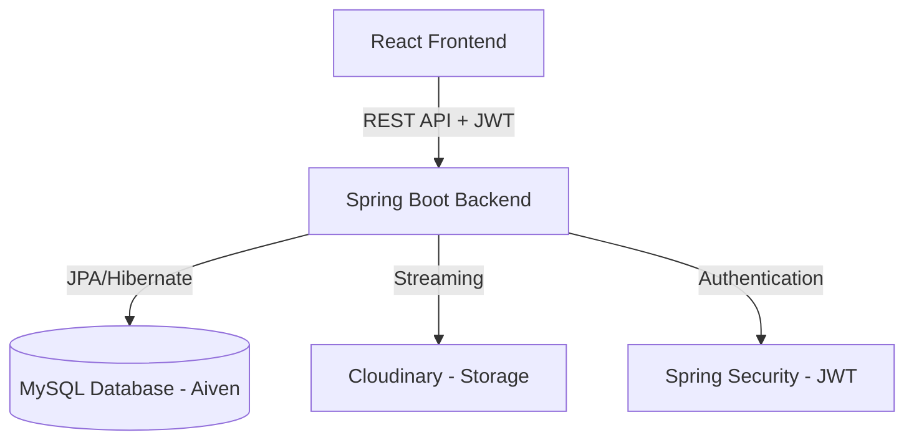

# Employee Management System (EMS) - Full Stack
A robust, enterprise-grade Employee Management System built with **Spring Boot 3**, **React 18**, and **MySQL**. This application provides a comprehensive suite of tools for managing employees, tracking attendance, handling salaries, and secure document storage.
### 🔗 Live Production Links
- **Frontend (Vercel)**: [https://employment-management-system-gamma.vercel.app/](https://employment-management-system-gamma.vercel.app/)
- **Backend (Render)**: [https://employment-management-system-mt72.onrender.com](https://employment-management-system-mt72.onrender.com)
- **Database**: Managed MySQL (Aiven)
---
## 🛠️ Tech Stack
### Backend
- **Java 21** / **Spring Boot 3.4**
- **Spring Security** (JWT-based Authentication)
- **Spring Data JPA** (Hibernate 6)
- **Cloudinary SDK** (Secure File & PDF Storage)
- **Lombok** (Boilerplate reduction)
- **MySQL 8** (Database)
### Frontend
- **React 18** (Vite)
- **Vanilla CSS** (Custom Premium UI/UX)
- **Axios** (API Interfacing)
- **Lucide-React** (Iconography)
---
##  Key Features
- **Role-Based Access Control (RBAC)**: Secure access for Admins and Staff.
- **Interactive Dashboard**: Real-time analytics, charts (Recharts), and system overviews.
- **Document Management**: 
    - Secure PDF/Resume uploads via Cloudinary.
    - **Signed URLs**: Temporary secure links for document downloads to resolve access restrictions.
- **Salary Management**: Track salary history and payroll simulations.
- **Attendance & Leave**: Automated leave balance tracking and attendance logs.
- **Premium UI**: Dark-mode support, HSL-tailored color palettes, and glassmorphism effects.
---
## 🏗️ Technical Architecture

The system follows a classic **N-tier Architecture** with a clear separation between the presentation, business logic, and data layers.

### 🔹 Layered Design
- **Presentation Layer**: Built with **React**; uses **Axios** to communicate with the backend. It's fully stateless, relying on JWT tokens stored in the browser.
- **Security Layer**: **Spring Security** intercepts every request, validates the JWT, and enforces Role-Based Access Control (RBAC).
- **Service Layer**: Contains the core business logic, including salary calculations, attendance processing, and Cloudinary file handling.
- **Persistence Layer**: **Spring Data JPA** manages the database interactions with MySQL, ensuring data integrity and version control via Hibernate.
---

*Developed by Anil Kumar Adapa - 2026*
